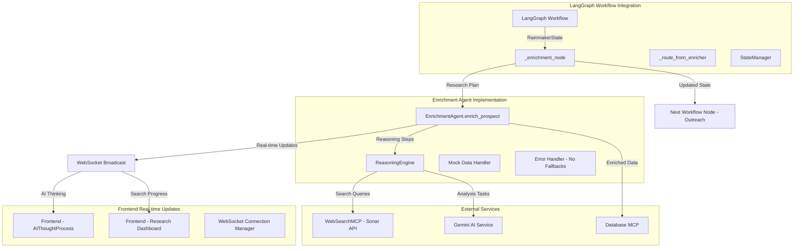
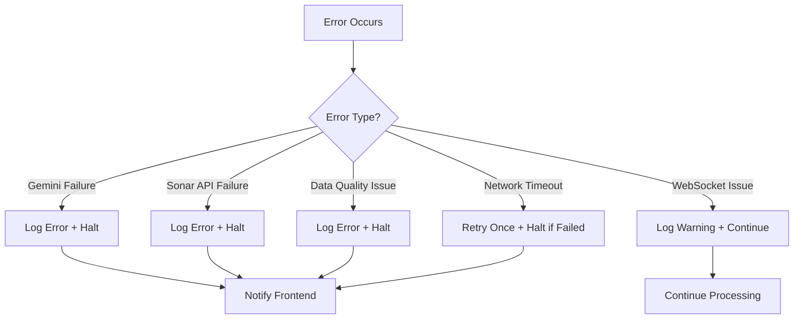

# Design Document

## Overview

The enrichment agent rebuild creates a sophisticated AI-powered research system specifically designed for event planning lead generation. The system receives prospect data about people actively planning events (weddings, corporate events, birthdays, etc.) from the prospect hunter, then conducts deep research to understand their event needs, preferences, budget, and personal context. This enriched data enables highly personalized outreach where we position ourselves as event planners who can help them achieve their event goals.

**Core Purpose**: Transform basic prospect data ("Sarah is planning a wedding") into comprehensive profiles ("Sarah, 28, marketing manager at TechCorp, planning a 150-guest outdoor wedding in Napa Valley for next June, budget $25-30K, prefers rustic-elegant style, active on Instagram, values sustainability") to enable personalized outreach like "Hi Sarah, we specialize in sustainable outdoor weddings in Napa Valley and would love to help make your June wedding dreams come true."

## Architecture

### High-Level Architecture



### Component Interaction Flow - Event Planning Context

1. **LangGraph Workflow** calls `_enrichment_node` with prospect data (e.g., "John Smith planning corporate retreat in Austin")
2. **_enrichment_node** updates state to `WorkflowStage.ENRICHING` and calls `EnrichmentAgent.enrich_prospect`
3. **EnrichmentAgent** creates event-focused research plan: "Research John Smith's company, role, retreat requirements, budget indicators, preferred venues, team size, etc."
4. **ReasoningEngine** breaks down research: "First, find John's LinkedIn to understand his role and company size. Then search for his company's previous events to gauge budget. Finally, look for any mentions of retreat preferences or requirements."
5. **WebSearchMCP** conducts targeted Sonar searches: "John Smith TechCorp corporate retreat", "TechCorp company events budget", "John Smith event planning preferences"
6. **Gemini AI Service** analyzes findings: "John is VP of Operations at 200-person tech company. Company spent $50K on last retreat. John posted about wanting 'team building focused' activities. High-value prospect for corporate event planning."
7. **WebSocket Broadcast** shows AI thinking: "Analyzing John's role... Found company size... Researching budget indicators... High confidence this is a qualified lead"
8. **Frontend Components** display research progress: "Searching LinkedIn for John Smith... Analyzing TechCorp event history... Building prospect profile..."
9. **EnrichmentAgent** creates comprehensive event planning profile with personalization opportunities
10. **_route_from_enricher** sends enriched data to outreach agent for personalized event planning pitch
11. **Database MCP** stores enriched prospect data for CRM integration

## Components and Interfaces

### 1. Enhanced Enrichment Agent

**File**: `Rainmaker-backend/app/agents/enrichment.py`

**Core Responsibilities**:
- Receive prospect data from orchestrator
- Create and execute research plans
- Coordinate between reasoning engine and external APIs
- Manage real-time frontend updates
- Handle mock data for development/testing

**Key Methods**:
```python
class EnrichmentAgent:
    async def enrich_prospect(self, state: RainmakerState) -> RainmakerState
    async def create_research_plan(self, prospect_data: ProspectData) -> ResearchPlan
    async def execute_research_step(self, step: ResearchStep) -> StepResult
    async def broadcast_reasoning(self, reasoning: str, step_type: str)
    async def handle_mock_data_research(self, mock_prospect: ProspectData)
```

**Interface with LangGraph Workflow**:
```python
# Called by _enrichment_node in workflow.py
async def _enrichment_node(self, state: RainmakerState) -> RainmakerState:
    """Enrichment agent node - enrich prospect data with AI reasoning"""
    logger.info("Starting prospect enrichment", workflow_id=state["workflow_id"])
    
    try:
        # Update stage using StateManager
        state = StateManager.update_stage(state, WorkflowStage.ENRICHING)
        
        # Create enrichment agent instance
        enrichment_agent = EnrichmentAgent()
        
        # Execute enrichment with real-time updates
        enriched_state = await enrichment_agent.enrich_prospect(state)
        
        # Validate enrichment results
        if not enriched_state.get("enrichment_data"):
            raise Exception("Enrichment failed to produce data")
        
        return enriched_state
        
    except Exception as e:
        logger.error("Enrichment failed", error=str(e), workflow_id=state["workflow_id"])
        return StateManager.add_error(state, "enricher", "enrichment_failure", str(e))

# Input state structure (from LangGraph)
state: RainmakerState = {
    "workflow_id": str,
    "prospect_data": ProspectData,
    "current_stage": WorkflowStage.HUNTING,  # Will be updated to ENRICHING
    "completed_stages": [WorkflowStage.HUNTING],
    "hunter_results": HunterResults,  # Available from previous stage
    # ... other workflow state
}

# Output state structure (returned to LangGraph)
enriched_state: RainmakerState = {
    "workflow_id": str,
    "prospect_data": ProspectData,
    "current_stage": WorkflowStage.ENRICHING,
    "completed_stages": [WorkflowStage.HUNTING, WorkflowStage.ENRICHING],
    "enrichment_data": EnrichmentData,  # New enriched data
    "hunter_results": HunterResults,  # Preserved from previous stage
    # ... other workflow state preserved
}
```

### 2. AI Reasoning Engine

**File**: `Rainmaker-backend/app/services/reasoning_engine.py`

**Core Responsibilities**:
- Create step-by-step research plans
- Generate reasoning explanations for each decision
- Coordinate with Gemini AI for analysis
- Provide fallback-free error handling

**Key Methods**:
```python
class ReasoningEngine:
    async def create_research_plan(self, prospect: ProspectData) -> ResearchPlan
    async def reason_through_step(self, step: ResearchStep, data: Dict) -> ReasoningResult
    async def analyze_with_gemini(self, data: Dict, analysis_type: str) -> AnalysisResult
    async def explain_decision(self, decision: str, context: Dict) -> str
```

**Research Plan Structure**:
```python
@dataclass
class ResearchPlan:
    prospect_id: str
    steps: List[ResearchStep]
    estimated_duration: int
    reasoning: str

@dataclass
class ResearchStep:
    step_id: str
    step_type: str  # 'search', 'analyze', 'synthesize'
    description: str
    reasoning: str
    dependencies: List[str]
    expected_output: str
```

### 3. Rebuilt Web Search MCP

**File**: `Rainmaker-backend/app/mcp/web_search.py`

**Core Responsibilities**:
- Interface with Sonar API for prospect research
- Handle rate limiting and error management
- Structure search results for AI analysis
- No hardcoded search patterns - fully AI-driven

**Key Methods**:
```python
class WebSearchMCP:
    async def search_prospect_info(self, query: str, context: Dict) -> SearchResult
    async def search_company_details(self, company: str, context: Dict) -> SearchResult
    async def search_social_presence(self, person: str, company: str) -> SearchResult
    async def search_event_history(self, search_params: Dict) -> SearchResult
```

**Search Result Structure**:
```python
@dataclass
class SearchResult:
    query: str
    results: List[Dict[str, Any]]
    confidence_score: float
    source_count: int
    search_metadata: Dict[str, Any]
    reasoning: str  # Why this search was conducted
```

### 4. WebSocket Broadcasting Integration

**Integration with Existing Orchestrator WebSocket System**

The enrichment agent will integrate with the existing WebSocket broadcasting system in `orchestrator.py`:

**Enhanced Orchestrator Broadcasting**:
```python
# In orchestrator.py - enhanced _broadcast_workflow_event method
async def _broadcast_workflow_event(self, workflow_id: str, event_type: str, data: Any):
    """Enhanced to handle enrichment agent reasoning updates"""
    
    # Handle enrichment-specific events
    if event_type == "enrichment_reasoning":
        message = {
            "type": "enrichment_reasoning",
            "workflow_id": workflow_id,
            "reasoning": data.get("reasoning"),
            "step_type": data.get("step_type"),
            "confidence": data.get("confidence", 0.0),
            "timestamp": datetime.now().isoformat()
        }
    elif event_type == "enrichment_search_progress":
        message = {
            "type": "enrichment_search_progress", 
            "workflow_id": workflow_id,
            "search_description": data.get("search_description"),
            "progress_percentage": data.get("progress_percentage"),
            "current_source": data.get("current_source"),
            "results_found": data.get("results_found", 0),
            "timestamp": datetime.now().isoformat()
        }
    else:
        # Existing workflow event handling
        message = {
            "type": "workflow_event",
            "workflow_id": workflow_id,
            "event_type": event_type,
            "timestamp": datetime.now().isoformat(),
            "data": self._serialize_event_data(data)
        }
    
    # Send to all connected clients (existing logic)
    for websocket in self.websocket_connections:
        try:
            await websocket.send_text(json.dumps(message))
        except Exception as e:
            logger.warning("Failed to send WebSocket message", error=str(e))
```

**Enrichment Agent Broadcasting Methods**:
```python
class EnrichmentAgent:
    def __init__(self):
        # Reference to global orchestrator for broadcasting
        from app.services.orchestrator import agent_orchestrator
        self.orchestrator = agent_orchestrator
    
    async def broadcast_reasoning(self, workflow_id: str, reasoning: str, step_type: str, confidence: float = 0.0):
        """Broadcast AI reasoning to frontend via orchestrator"""
        await self.orchestrator._broadcast_workflow_event(
            workflow_id, 
            "enrichment_reasoning",
            {
                "reasoning": reasoning,
                "step_type": step_type,
                "confidence": confidence
            }
        )
    
    async def broadcast_search_progress(self, workflow_id: str, search_info: Dict):
        """Broadcast search progress to frontend via orchestrator"""
        await self.orchestrator._broadcast_workflow_event(
            workflow_id,
            "enrichment_search_progress", 
            search_info
        )
```

**Message Formats**:
```python
# AI Reasoning Update
{
    "type": "ai_reasoning",
    "workflow_id": str,
    "reasoning": str,
    "step_type": str,  # 'planning', 'searching', 'analyzing', 'synthesizing'
    "timestamp": str,
    "confidence": float
}

# Search Progress Update
{
    "type": "search_progress",
    "workflow_id": str,
    "search_description": str,
    "progress_percentage": int,
    "current_source": str,
    "results_found": int
}
```

### 5. Frontend Components

**AI Thought Process Component** (Enhanced):
```typescript
interface AIThoughtProcessProps {
    workflowId: string
    agentType: 'enrichment'
}

// Displays real-time AI reasoning similar to existing AIThoughtProcess
// but specifically for enrichment agent thinking
```

**Research Dashboard Component**:
```typescript
interface ResearchDashboardProps {
    workflowId: string
    onStatusChange?: (status: ResearchStatus) => void
}

// New component showing:
// - Current search being conducted
// - Search progress indicators
// - Sources being analyzed
// - Data quality metrics
```

## Data Models

### Enhanced Enrichment Data Structure

```python
@dataclass
class EnrichmentData:
    # Core prospect information
    prospect_id: str
    enrichment_id: str
    
    # Personal/Professional Details
    personal_details: PersonalDetails
    professional_details: ProfessionalDetails
    company_information: CompanyInformation
    
    # Event Planning Context
    event_preferences: EventPreferences
    budget_analysis: BudgetAnalysis
    engagement_history: EngagementHistory
    
    # Social and Digital Presence
    social_profiles: Dict[str, SocialProfile]
    digital_footprint: DigitalFootprint
    
    # AI Analysis Results
    ai_insights: AIInsights
    confidence_scores: ConfidenceScores
    
    # Metadata
    research_metadata: ResearchMetadata
    enrichment_timestamp: datetime
    data_sources: List[DataSource]

@dataclass
class PersonalDetails:
    full_name: str
    age_range: Optional[str]
    location: LocationDetails
    family_status: Optional[str]
    interests: List[str]
    lifestyle_indicators: List[str]

@dataclass
class ProfessionalDetails:
    job_title: Optional[str]
    company_name: Optional[str]
    industry: Optional[str]
    seniority_level: Optional[str]
    professional_network_size: Optional[str]
    decision_making_authority: Optional[str]

@dataclass
class EventPreferences:
    # Core event details
    event_type: str  # "wedding", "corporate_retreat", "birthday_party"
    event_date: Optional[str]  # When they're planning the event
    guest_count_estimate: Optional[str]  # "50-100", "150+", "intimate gathering"
    
    # Venue and style preferences
    venue_preferences: VenuePreferences  # indoor/outdoor, formal/casual, specific locations
    style_preferences: StylePreferences  # rustic, modern, elegant, fun, professional
    
    # Service expectations
    service_level_expectations: ServiceLevelExpectations  # full-service, partial, DIY support
    communication_preferences: CommunicationPreferences  # email, phone, text, in-person
    
    # Event-specific needs
    special_requirements: List[str]  # accessibility, dietary, cultural, sustainability
    must_have_elements: List[str]  # live music, photography, catering style, etc.
    
    # Planning timeline and urgency
    planning_timeline: Optional[str]  # "6 months out", "urgent - 2 months", "flexible"
    decision_making_urgency: str  # "actively booking", "researching options", "early planning"

@dataclass
class AIInsights:
    # Event planning specific insights
    event_planning_readiness: EventPlanningReadiness  # "actively planning", "early research", "decision ready"
    budget_assessment: BudgetAssessment  # estimated range, spending indicators, decision authority
    timeline_urgency: TimelineUrgency  # how soon they need services, booking urgency
    
    # Personalization for event planning outreach
    personalization_opportunities: List[PersonalizationOpportunity]  # specific event details to mention
    value_proposition_match: ValuePropositionMatch  # which of our services best match their needs
    
    # Engagement strategy for event planners
    recommended_outreach_approach: RecommendedOutreachApproach  # email tone, key selling points
    best_contact_method: str  # email, LinkedIn, phone based on their digital presence
    optimal_timing: str  # when to reach out based on their planning timeline
    
    # Risk and opportunity assessment
    conversion_likelihood: float  # 0.0-1.0 based on event planning signals
    competition_risk: List[str]  # signs they might be working with other planners
    unique_selling_opportunities: List[str]  # what makes us the best fit for their event
```

### Mock Data Structure

```python
@dataclass
class MockProspectData:
    # Basic prospect information
    name: str
    company: Optional[str]
    location: str
    prospect_type: str  # 'individual' or 'corporate'
    
    # Event planning context (core purpose)
    event_context: str  # "planning wedding for June 2025"
    event_type: str  # "wedding", "corporate_retreat", "birthday_celebration"
    initial_signals: List[str]  # What indicated they're planning an event
    
    # Research validation flags
    expect_social_presence: bool
    expect_company_info: bool
    expect_event_history: bool
    
    # Expected research outcomes
    expected_confidence_score: float
    expected_data_sources: List[str]
    expected_insights: List[str]  # What we expect to learn about their event needs
    
    # Outreach preparation
    outreach_angle: str  # How we'll position our event planning services
```

## Error Handling

### No-Fallback Error Strategy - LangGraph Integration

The system implements a strict no-fallback approach that integrates with LangGraph's error handling:

1. **Gemini AI Failures**: Use `StateManager.add_error()` to halt workflow and trigger `_route_from_enricher` to escalate
2. **Sonar API Failures**: Add error to state, workflow routes to error handler or human escalation
3. **Data Quality Issues**: Flag in state, workflow routing determines retry or escalation
4. **WebSocket Failures**: Log but continue processing (non-critical for enrichment success)

**Integration with Existing Error Handling**:
```python
# In enrichment agent - no fallbacks, use StateManager
async def enrich_prospect(self, state: RainmakerState) -> RainmakerState:
    try:
        # Enrichment logic here
        pass
    except GeminiAnalysisError as e:
        # No fallback - add error and let workflow handle routing
        return StateManager.add_error(
            state, "enricher", "gemini_failure", str(e),
            {"error_type": "critical", "requires_escalation": True}
        )
    except SonarAPIError as e:
        # No fallback - add error and let workflow handle routing  
        return StateManager.add_error(
            state, "enricher", "sonar_api_failure", str(e),
            {"error_type": "critical", "requires_escalation": True}
        )

# In workflow.py - _route_from_enricher handles errors
def _route_from_enricher(self, state: RainmakerState) -> str:
    """Enhanced routing to handle enrichment-specific errors"""
    errors = state.get("errors", [])
    
    if errors:
        latest_error = errors[-1]
        
        # Check for critical enrichment errors
        if (latest_error.agent_name == "enricher" and 
            latest_error.details.get("error_type") == "critical"):
            return "escalate"  # Immediate escalation for Gemini/Sonar failures
        
        # Standard retry logic for other errors
        if state.get("retry_count", 0) >= state.get("max_retries", 3):
            return "escalate"
        else:
            return "error_handler"
    
    # Success path
    elif not state.get("enrichment_data"):
        return "escalate"  # No enrichment data produced
    else:
        return "outreach"  # Continue to next stage
```

### Error Types and Responses

```python
class EnrichmentError(Exception):
    """Base class for enrichment errors"""
    pass

class GeminiAnalysisError(EnrichmentError):
    """Gemini AI analysis failed - halt processing"""
    pass

class SonarAPIError(EnrichmentError):
    """Sonar API unavailable - halt processing"""
    pass

class DataQualityError(EnrichmentError):
    """Insufficient data quality - halt processing"""
    pass
```

### Error Handling Flow



## Testing Strategy

### Mock Data Testing

1. **Real Prospect Research**: Use predefined real prospects for testing
2. **API Response Validation**: Verify Sonar API integration with real data
3. **AI Reasoning Validation**: Test Gemini analysis with known prospect data
4. **Frontend Integration**: Validate WebSocket updates and UI rendering

### Test Data Sets - Real Event Planning Prospects

```python
MOCK_PROSPECTS = [
    MockProspectData(
        name="Sarah Johnson",
        company="TechCorp Inc",
        location="San Francisco, CA",
        prospect_type="individual",
        event_context="planning wedding for June 2025",
        event_type="wedding",
        initial_signals=["engagement announcement on Instagram", "looking for wedding venues in Napa Valley"],
        expect_social_presence=True,
        expect_company_info=True,  # For budget assessment
        expect_event_history=False,
        expected_confidence_score=0.9,
        expected_data_sources=["instagram", "linkedin", "wedding_websites", "sonar_search"],
        expected_insights=["budget range $20-30K", "prefers outdoor venues", "sustainable/eco-friendly focus"],
        outreach_angle="sustainable outdoor weddings in Napa Valley"
    ),
    MockProspectData(
        name="Michael Chen",
        company="DataFlow Solutions",
        location="Austin, TX", 
        prospect_type="corporate",
        event_context="planning company retreat for Q2 2025",
        event_type="corporate_retreat",
        initial_signals=["posted on LinkedIn about team building needs", "company growing rapidly"],
        expect_social_presence=True,
        expect_company_info=True,
        expect_event_history=True,  # Previous company events
        expected_confidence_score=0.8,
        expected_data_sources=["linkedin", "company_website", "business_news", "sonar_search"],
        expected_insights=["100+ employees", "tech company budget $30-50K", "focus on team building"],
        outreach_angle="corporate retreat planning for growing tech companies"
    ),
    MockProspectData(
        name="Jennifer Martinez",
        company=None,
        location="Miami, FL",
        prospect_type="individual", 
        event_context="planning 50th birthday party for husband",
        event_type="birthday_celebration",
        initial_signals=["Facebook post about milestone birthday planning", "looking for party venues"],
        expect_social_presence=True,
        expect_company_info=False,
        expect_event_history=True,  # Previous family celebrations
        expected_confidence_score=0.7,
        expected_data_sources=["facebook", "local_event_sites", "sonar_search"],
        expected_insights=["milestone celebration", "family-focused", "Miami venue preferences"],
        outreach_angle="milestone birthday celebration planning in Miami"
    ),
    MockProspectData(
        name="Robert Kim",
        company="Kim & Associates Law Firm",
        location="Chicago, IL",
        prospect_type="corporate",
        event_context="planning annual client appreciation event",
        event_type="corporate_event",
        initial_signals=["law firm website mentions annual events", "previous event photos on LinkedIn"],
        expect_social_presence=True,
        expect_company_info=True,
        expect_event_history=True,
        expected_confidence_score=0.8,
        expected_data_sources=["linkedin", "law_firm_website", "event_photos", "sonar_search"],
        expected_insights=["upscale professional event", "client-facing", "annual tradition"],
        outreach_angle="elegant corporate events for professional services firms"
    )
]
```

### Integration Testing

1. **End-to-End Workflow**: Test complete enrichment flow with mock data
2. **WebSocket Communication**: Verify real-time updates reach frontend
3. **AI Reasoning Chain**: Validate step-by-step reasoning process
4. **Error Scenarios**: Test all error conditions and halt behaviors

### Performance Testing

1. **API Rate Limiting**: Test Sonar API rate limit handling
2. **Concurrent Enrichments**: Test multiple simultaneous enrichment processes
3. **WebSocket Scalability**: Test multiple frontend connections
4. **Memory Usage**: Monitor memory consumption during long research sessions

## Security and Privacy

### Data Protection

1. **API Key Security**: Secure storage and rotation of Sonar and Gemini API keys
2. **Data Encryption**: Encrypt prospect data in transit and at rest
3. **Access Control**: Role-based access to enrichment data
4. **Data Retention**: Automatic cleanup of enrichment data per privacy policies

### Privacy Compliance

1. **PII Handling**: Redact personally identifiable information from logs
2. **Consent Management**: Track consent for data processing
3. **Right to Deletion**: Support for prospect data deletion requests
4. **Audit Trails**: Comprehensive logging of all data access and processing

## Deployment Considerations

### Environment Configuration

```python
# Environment variables for enrichment agent
SONAR_API_KEY=<sonar_api_key>
GEMINI_API_KEY=<gemini_api_key>
ENRICHMENT_WEBSOCKET_URL=<websocket_endpoint>
MOCK_DATA_MODE=<true/false>
ENRICHMENT_RATE_LIMIT=<requests_per_minute>
```

### Monitoring and Observability

1. **Metrics Collection**: Track enrichment success rates, processing times, API usage
2. **Error Monitoring**: Real-time alerts for Gemini and Sonar API failures
3. **Performance Dashboards**: Monitor agent performance and resource usage
4. **Audit Logging**: Comprehensive logs for compliance and debugging

### Scalability

1. **Horizontal Scaling**: Support multiple enrichment agent instances
2. **Queue Management**: Handle prospect enrichment requests in priority order
3. **Resource Management**: Monitor and limit resource consumption per enrichment
4. **Load Balancing**: Distribute enrichment workload across available instances