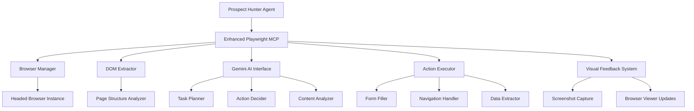

# Design Document

## Overview

The enhanced Playwright MCP will provide intelligent web navigation using DOM analysis and Gemini AI for prospect hunting across multiple websites. The design emphasizes fast DOM-based page analysis, AI-powered decision making, and practical prospect extraction from sites like Google, LinkedIn, and Eventbrite. This builds on the existing working browser foundation while adding intelligent automation capabilities.

## Architecture

### MVP Data Flow

```
1. Agent calls: intelligent_prospect_search("find wedding planners in Switzerland")
2. Navigate to first site (e.g., Google)
3. DOM Extractor: Get page elements as JSON
4. Simple Gemini Interface: "Here's the page, here's the goal, what should I do?"
5. AI responds: {"action": "type", "selector": "#search", "text": "wedding planners Switzerland"}
6. Action Executor: Execute the action
7. Repeat steps 3-6 until task complete
8. Return extracted prospect data
```

### High-Level Architecture



### Core Components (MVP)

1. **Enhanced Playwright MCP Server**: Main MCP interface with AI-powered navigation tools (builds on existing SimpleBrowserMCP)
2. **DOM Extractor**: Extracts page elements as JSON for AI analysis
3. **Simple Gemini Interface**: Send DOM + task, get action instructions
4. **Action Executor**: Execute the AI-determined action and repeat

### Additional Components (Add Later)
- Complex error recovery systems
- Sophisticated logging frameworks  
- Advanced performance monitoring
- Multi-session management

## Components and Interfaces

### Enhanced Playwright MCP Server

```python
class EnhancedPlaywrightMCP:
    """Main MCP server with AI-powered web navigation capabilities"""
    
    def __init__(self):
        self.browser_manager = BrowserManager()  # Extends existing implementation
        self.dom_extractor = DOMExtractor()
        self.gemini_interface = GeminiAIInterface()
        self.action_executor = ActionExecutor()
        self.visual_feedback = VisualFeedbackSystem()
    
    # MCP Tool Methods
    async def intelligent_prospect_search(self, task_description: str, target_sites: List[str], max_results: int) -> Dict
    async def navigate_and_extract(self, url: str, extraction_goal: str) -> Dict
    async def fill_search_form(self, page_url: str, search_terms: Dict[str, str]) -> Dict
    async def extract_prospect_data(self, page_url: str, data_requirements: List[str]) -> Dict
    async def test_browser_setup(self) -> Dict  # Maintains existing functionality
    async def request_human_assistance(self, reason: str, context: Dict) -> Dict
```

### Browser Manager

```python
class BrowserManager:
    """Extends existing browser management with AI-optimized features"""
    
    def __init__(self):
        # Builds on existing SimpleBrowserMCP foundation
        self.browser: Optional[Browser] = None
        self.page: Optional[Page] = None
        self.workflow_id: Optional[str] = None
    
    async def initialize_browser(self, headless: bool = False) -> Dict[str, Any]
    async def navigate_to_url(self, url: str) -> Dict[str, Any]
    async def wait_for_page_load(self, timeout: int = 30000) -> bool
    async def handle_page_errors(self, error: Exception) -> Dict[str, Any]
    async def cleanup_browser(self) -> None
    async def capture_page_state(self) -> Dict[str, Any]  # For visual feedback
```

### DOM Extractor

```python
class DOMExtractor:
    """Extracts page structure as structured text for AI analysis"""
    
    def __init__(self):
        self.element_selectors = {
            'interactive': 'button, a, input, select, textarea, [onclick], [role="button"]',
            'forms': 'form, input, select, textarea',
            'content': 'h1, h2, h3, h4, h5, h6, p, span, div[class*="content"]',
            'navigation': 'nav, [role="navigation"], .nav, .menu'
        }
    
    async def extract_page_structure(self, page: Page) -> Dict[str, Any]
    async def extract_interactive_elements(self, page: Page) -> List[Dict[str, Any]]
    async def extract_form_elements(self, page: Page) -> List[Dict[str, Any]]
    async def extract_content_elements(self, page: Page) -> List[Dict[str, Any]]
    async def build_element_context(self, element: Dict, surrounding_text: str) -> Dict[str, Any]
    async def create_ai_prompt_data(self, page_structure: Dict, task_goal: str) -> str
```

### Simple Gemini Interface (MVP)

```python
class SimpleGeminiInterface:
    """Simple AI interface: send DOM + task, get action"""
    
    def __init__(self):
        self.gemini_client = self._initialize_gemini_client()
    
    async def get_next_action(self, page_elements: Dict, task_goal: str) -> Dict[str, Any]:
        """
        Send page elements and task to AI, get back single action to take
        Returns: {"action": "click", "selector": "#search-btn", "reasoning": "..."}
        """
        prompt = self._build_simple_prompt(page_elements, task_goal)
        response = await self.gemini_client.generate_content(prompt)
        return self._parse_action_response(response.text)
    
    def _build_simple_prompt(self, elements: Dict, goal: str) -> str:
        """Build simple prompt: here's the page, here's the goal, what should I do?"""
        pass
    
    def _parse_action_response(self, response: str) -> Dict[str, Any]:
        """Parse AI response into actionable instruction"""
        pass
```

### Simple Action Executor (MVP)

```python
class SimpleActionExecutor:
    """Execute basic actions: click, type, extract"""
    
    async def execute_action(self, page: Page, action: Dict[str, Any]) -> Dict[str, Any]:
        """
        Execute single action from AI
        action = {"action": "click", "selector": "#btn", "text": "optional"}
        """
        action_type = action.get("action")
        selector = action.get("selector")
        
        if action_type == "click":
            return await self._click_element(page, selector)
        elif action_type == "type":
            return await self._type_text(page, selector, action.get("text"))
        elif action_type == "extract":
            return await self._extract_data(page, action.get("data_type"))
        else:
            return {"success": False, "error": f"Unknown action: {action_type}"}
    
    async def _click_element(self, page: Page, selector: str) -> Dict[str, Any]
    async def _type_text(self, page: Page, selector: str, text: str) -> Dict[str, Any]  
    async def _extract_data(self, page: Page, data_type: str) -> Dict[str, Any]
```

### Visual Feedback (Reuse Existing)

```python
# Use existing browser viewer system from SimpleBrowserMCP
# Just call self._capture_browser_step(page, step_name, details) 
# This already handles screenshots and frontend updates

class SimpleVisualFeedback:
    """Reuse existing screenshot capture system"""
    
    def __init__(self, browser_viewer_callback):
        self.browser_viewer_callback = browser_viewer_callback
    
    async def capture_ai_step(self, page: Page, step_name: str, ai_reasoning: str) -> None:
        """Reuse existing _capture_browser_step method"""
        details = f"AI Decision: {ai_reasoning}"
        # Call existing capture method from SimpleBrowserMCP
        self._capture_browser_step(page, step_name, details)
```

## Data Models

### Prospect Data Structure

```python
@dataclass
class AIExtractedProspect:
    """Prospect data extracted through AI-powered web navigation"""
    
    # Basic Information
    name: str
    source_url: str
    extraction_method: str  # "ai_navigation", "form_search", "content_analysis"
    
    # Contact Information
    email: Optional[str] = None
    phone: Optional[str] = None
    location: Optional[str] = None
    website: Optional[str] = None
    
    # Professional Information
    company: Optional[str] = None
    job_title: Optional[str] = None
    industry: Optional[str] = None
    
    # Event Planning Context
    event_type: str  # wedding, corporate, birthday, etc.
    event_signals: List[str]
    event_context: str
    planning_stage: Optional[str] = None  # early, active, urgent
    
    # AI Analysis Results
    ai_confidence_score: float  # 0.0-1.0
    data_completeness_score: float  # 0.0-1.0
    relevance_score: float  # 0.0-1.0
    ai_reasoning: str  # Why this was identified as a prospect
    
    # Extraction Metadata
    extracted_at: datetime
    extraction_source: str  # website domain
    ai_model_used: str
    extraction_steps: List[str]  # Steps taken to find this data
    raw_extracted_data: Dict[str, Any]
```

### AI Task Execution State

```python
@dataclass
class AITaskState:
    """State tracking for AI-driven task execution"""
    
    task_id: str
    task_description: str
    current_url: str
    current_step: int
    total_estimated_steps: int
    
    # AI Decision Context
    ai_analysis_history: List[Dict[str, Any]]
    current_page_understanding: Dict[str, Any]
    next_planned_actions: List[Dict[str, Any]]
    
    # Execution Progress
    completed_actions: List[Dict[str, Any]]
    collected_data: Dict[str, Any]
    encountered_errors: List[Dict[str, Any]]
    
    # Task Status
    status: str  # "planning", "executing", "completed", "failed", "needs_human_help"
    confidence_level: float  # AI's confidence in current approach
    estimated_completion_time: Optional[datetime]
    
    # Metadata
    started_at: datetime
    last_updated: datetime
    workflow_id: Optional[str] = None
```

### AI Navigation Session

```python
@dataclass
class AINavigationSession:
    """Session tracking for AI-powered web navigation"""
    
    session_id: str
    task_type: str  # "prospect_search", "data_extraction", "form_filling"
    target_sites: List[str]
    search_parameters: Dict[str, Any]
    
    # Execution Tracking
    started_at: datetime
    completed_at: Optional[datetime]
    sites_visited: List[str]
    pages_analyzed: int
    prospects_found: int
    
    # AI Performance Metrics
    ai_decisions_made: int
    ai_confidence_average: float
    successful_actions: int
    failed_actions: int
    human_interventions_required: int
    
    # Results
    session_status: str  # "running", "completed", "failed", "paused", "needs_human_help"
    final_results: Dict[str, Any]
    error_summary: List[str]
    performance_metrics: Dict[str, float]
```

## Error Handling

### Error Categories

1. **AI Decision Errors**: AI unable to understand page structure or determine next action
2. **Element Interaction Errors**: Elements not found, not clickable, or changed after AI analysis
3. **Page Loading Errors**: Timeouts, network issues, or unexpected page redirects
4. **Authentication Errors**: Login required, session expired, or access denied
5. **Content Extraction Errors**: Expected data not found or in unexpected format
6. **Task Completion Errors**: Unable to achieve task goal or partial completion only

### Simple Error Handling (MVP)

```python
# Start with basic error handling, add AI recovery later
class SimpleErrorHandler:
    """Basic error handling - log and retry or fail gracefully"""
    
    async def handle_action_error(self, error: Exception, action: Dict) -> Dict[str, Any]:
        """Simple error handling: log error, return failure result"""
        logger.error(f"Action failed: {action}", error=str(error))
        return {
            "success": False, 
            "error": str(error),
            "failed_action": action,
            "suggestion": "Try different selector or approach"
        }
```

## Testing Strategy

### Unit Testing

1. **DOM Extractor Tests**: Page structure extraction, element identification, context building
2. **Gemini AI Interface Tests**: AI prompt generation, response parsing, decision validation
3. **Action Executor Tests**: Form filling, navigation, data extraction, error handling
4. **Visual Feedback Tests**: Screenshot capture, browser viewer updates, step tracking
5. **Browser Manager Tests**: Browser lifecycle, page navigation, resource cleanup

### Integration Testing

1. **End-to-End AI Navigation Tests**: Full workflow from task description to prospect extraction
2. **Multi-Site Tests**: AI navigation across different website structures and layouts
3. **Error Recovery Tests**: AI-powered error analysis and recovery mechanisms
4. **Performance Tests**: AI processing overhead, browser resource usage, response times
5. **Human-in-the-Loop Tests**: Authentication flows and assistance request handling

### Simple Testing (MVP)

```python
# Start with basic unit tests, add sophisticated AI testing later
class BasicAITests:
    """Basic testing for core functionality"""
    
    def test_dom_extraction(self):
        """Test that DOM extraction returns expected structure"""
        pass
    
    def test_ai_action_parsing(self):
        """Test that AI responses parse into valid actions"""
        pass
    
    def test_action_execution(self):
        """Test that actions execute successfully"""
        pass
```

## Security Considerations

### Data Protection

1. **Session Encryption**: All saved cookies and session data encrypted at rest
2. **Memory Cleanup**: Sensitive data cleared from memory after use
3. **Secure Storage**: Authentication tokens stored in encrypted format
4. **Access Control**: MCP tools require proper authentication to access

### Privacy Compliance

1. **Respect Platform Terms**: Scraping within platform terms of service
2. **Rate Limiting**: Respectful scraping with appropriate delays
3. **Data Minimization**: Only collect necessary prospect information
4. **User Consent**: Clear disclosure of data collection practices

### Anti-Detection Measures

1. **Stealth Mode**: Browser fingerprint randomization and stealth plugins
2. **Human-Like Behavior**: Random delays, mouse movements, scroll patterns
3. **User Agent Rotation**: Realistic browser fingerprints and headers
4. **IP Management**: Support for proxy rotation if needed

## Performance Optimization

### Browser Resource Management

1. **Memory Optimization**: Efficient page cleanup and resource disposal
2. **Concurrent Scraping**: Safe multi-platform scraping with resource limits
3. **Caching Strategy**: Intelligent caching of frequently accessed data
4. **Background Processing**: Asynchronous prospect analysis and scoring

### Scalability Considerations

1. **Browser Pool Management**: Multiple browser instances for high-volume scraping
2. **Queue Management**: Prioritized scraping requests with backpressure handling
3. **Resource Monitoring**: Memory and CPU usage tracking with alerts
4. **Graceful Degradation**: Fallback strategies when resources are constrained

## Monitoring and Logging

### Comprehensive Logging

```python
class ScrapingLogger:
    """Structured logging for all scraping operations"""
    
    def log_scraping_start(self, platform: str, query: str, session_id: str) -> None
    def log_authentication_request(self, platform: str, reason: str) -> None
    def log_prospects_found(self, platform: str, count: int, confidence_dist: Dict) -> None
    def log_error_with_context(self, error: Exception, context: Dict) -> None
    def log_performance_metrics(self, session_id: str, metrics: Dict) -> None
    def log_rate_limit_encounter(self, platform: str, retry_after: int) -> None
```

### Metrics Collection

1. **Success Rates**: Scraping success rates by platform and query type
2. **Performance Metrics**: Average scraping time, prospects per session
3. **Error Tracking**: Error frequency by type and platform
4. **Authentication Metrics**: Login success rates, session duration
5. **Resource Usage**: Memory consumption, browser instance counts

## Integration Points

### Existing Agent Integration

The enhanced MCP maintains compatibility with existing prospect hunter while adding new AI capabilities:

```python
# Existing interface maintained (builds on current tomato test)
async def test_browser(self, test_query: str, headless: bool) -> Dict[str, Any]

# New AI-powered interfaces
async def intelligent_prospect_search(self, task_description: str, target_sites: List[str]) -> Dict[str, Any]
async def navigate_and_extract(self, url: str, extraction_goal: str) -> Dict[str, Any]
async def fill_search_form(self, page_url: str, search_terms: Dict[str, str]) -> Dict[str, Any]
```

### Database Integration

AI-extracted prospects integrate with existing database schema:

```sql
-- Enhanced prospect table with AI extraction fields
ALTER TABLE prospects ADD COLUMN extraction_method VARCHAR(50);
ALTER TABLE prospects ADD COLUMN ai_confidence_score FLOAT;
ALTER TABLE prospects ADD COLUMN ai_reasoning TEXT;
ALTER TABLE prospects ADD COLUMN extraction_steps TEXT;
ALTER TABLE prospects ADD COLUMN source_url VARCHAR(500);
```

### State Management Integration

The MCP integrates with the existing RainmakerState for workflow coordination:

```python
# Enhanced state with AI navigation context
state["hunter_results"].ai_navigation_sessions = session_data
state["hunter_results"].ai_confidence_scores = confidence_metrics
state["hunter_results"].sites_successfully_navigated = site_list
state["hunter_results"].human_interventions_required = intervention_count
```