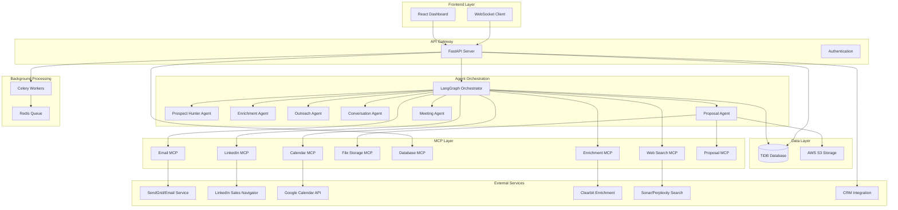

# Rainmaker MVP Design Document

## Overview

Rainmaker is an AI-powered event planning sales assistant built with a modern, scalable architecture. The system uses a multi-agent approach powered by LangGraph to automate the sales pipeline from prospect discovery through deal closure. The architecture separates concerns between a React frontend for user interaction and a FastAPI backend that orchestrates AI agents and manages data.

### Key Design Principles

- **Agent-First Architecture**: Each major business function is handled by a specialized AI agent
- **Human-in-the-Loop**: Critical actions require human approval to maintain quality and compliance
- **Scalable Foundation**: Built to handle growth from MVP to enterprise scale
- **API-First Design**: Clean separation between frontend and backend enables future integrations
- **Real-Time Updates**: WebSocket integration provides immediate feedback on agent activities

## Architecture

### High-Level System Architecture



### Technology Stack

**Frontend:**
- React 18.2+ with TypeScript
- Vite for build tooling
- TailwindCSS for styling
- React Query for server state management
- Zustand for client state management
- Socket.io-client for real-time updates

**Backend:**
- FastAPI 0.104+ (Python async web framework)
- LangGraph for agent orchestration
- SQLAlchemy 2.0 with async support
- Celery + Redis for background processing
- Socket.io for real-time communication
- Pydantic v2 for data validation

**Infrastructure:**
- TiDB Serverless for primary database
- AWS S3 for file storage
- Redis for caching and job queues
- AWS deployment (ECS Fargate + Lambda)

**External APIs & Dependencies:**
- OpenAI API (GPT-4) for agent intelligence
- Sonar/Perplexity API for web search and prospect discovery
- SendGrid/Mailgun for email delivery
- Clearbit API for company enrichment data
- Google Calendar API for meeting scheduling
- LinkedIn Sales Navigator API for B2B prospect discovery
- Twilio for SMS notifications (optional)
- Stripe for payment processing (future)

## Components and Interfaces

### Frontend Components

#### Dashboard Module
- **ProspectPipeline**: Visual pipeline showing prospects by stage
- **CampaignMetrics**: Performance tracking for outreach campaigns
- **RecentActivity**: Real-time feed of agent actions and prospect interactions
- **AgentStatus**: Monitor agent health and current operations

#### Prospect Management Module
- **ProspectList**: Searchable, filterable list of all prospects
- **ProspectDetails**: Comprehensive view of individual prospect data
- **EnrichmentPanel**: Display enriched data and manual override options
- **ProspectActions**: Quick actions for manual prospect management

#### Campaign Management Module
- **EmailEditor**: Template editor with personalization variables
- **CampaignBuilder**: Multi-step campaign creation wizard
- **OutreachTracker**: Monitor campaign performance and responses
- **ApprovalQueue**: Human approval interface for outbound messages

#### Conversation Module
- **ChatInterface**: Real-time conversation view with prospects
- **ConversationList**: All active and historical conversations
- **RequirementsExtractor**: Structured display of gathered event requirements
- **ResponseSuggestions**: AI-powered response recommendations

#### Proposal Module
- **ProposalBuilder**: Visual proposal creation with drag-and-drop components
- **PackageSelector**: Pre-built package templates for different event types
- **PricingCalculator**: Dynamic pricing based on requirements
- **ProposalPreview**: PDF preview and approval interface

### MCP (Model Context Protocol) Integration

The system leverages MCP tools to provide agents with standardized access to external services and data sources. This abstraction layer ensures consistent error handling, rate limiting, and authentication across all external integrations.

#### Core MCP Servers

**Web Search MCP**
- **Purpose**: Sonar/Perplexity API integration for prospect discovery
- **Functions**: `search_prospects`, `search_company_info`, `search_event_signals`
- **Rate Limiting**: 100 requests/hour per API key
- **Error Handling**: Fallback to Google Search API if Sonar unavailable

**Email MCP**
- **Purpose**: SendGrid/Mailgun integration for outreach campaigns
- **Functions**: `send_email`, `track_opens`, `handle_bounces`, `manage_unsubscribes`
- **Features**: Template management, personalization, delivery tracking
- **Compliance**: Automatic CAN-SPAM compliance headers

**Calendar MCP**
- **Purpose**: Google Calendar API integration for meeting scheduling
- **Functions**: `check_availability`, `create_event`, `send_invites`, `update_event`
- **Features**: Multi-calendar support, timezone handling, conflict detection
- **Authentication**: OAuth 2.0 with refresh token management

**File Storage MCP**
- **Purpose**: AWS S3 integration for proposal and document storage
- **Functions**: `upload_file`, `generate_signed_url`, `delete_file`, `list_files`
- **Features**: Automatic file organization, CDN integration, backup management
- **Security**: Pre-signed URLs for secure client-side uploads

**Database MCP**
- **Purpose**: TiDB Serverless integration with connection pooling
- **Functions**: `execute_query`, `bulk_insert`, `transaction_manager`, `health_check`
- **Features**: Connection pooling, query optimization, automatic failover
- **TiDB Benefits**: MySQL compatibility, horizontal scaling, HTAP capabilities
- **Serverless Advantages**: Auto-scaling, pay-per-use, zero maintenance
- **Monitoring**: Query performance tracking, slow query alerts, connection metrics

#### Custom MCP Tools

**Enrichment MCP**
- **Purpose**: Clearbit and company data aggregation
- **Functions**: `enrich_person`, `enrich_company`, `find_contacts`, `get_technographics`
- **Data Sources**: Clearbit, ZoomInfo (future), public records
- **Caching**: 24-hour cache for company data to reduce API costs

**LinkedIn MCP**
- **Purpose**: LinkedIn Sales Navigator API wrapper
- **Functions**: `search_prospects`, `get_profile`, `send_message`, `track_engagement`
- **Limitations**: Requires LinkedIn Sales Navigator subscription
- **Compliance**: Respects LinkedIn rate limits and terms of service

**Proposal MCP**
- **Purpose**: HTML to PDF generation for proposals
- **Functions**: `generate_pdf`, `create_mood_board`, `merge_templates`, `add_signatures`
- **Templates**: Event-type specific templates with dynamic content
- **Branding**: Client logo integration, custom color schemes

**Analytics MCP**
- **Purpose**: Campaign performance tracking and reporting
- **Functions**: `track_event`, `generate_report`, `calculate_metrics`, `export_data`
- **Metrics**: Open rates, response rates, conversion tracking, ROI calculation
- **Visualization**: Chart generation for dashboard display

#### MCP Configuration Management

```python
# MCP server configuration
MCP_SERVERS = {
    "web_search": {
        "command": "uvx",
        "args": ["sonar-search-mcp@latest"],
        "env": {
            "SONAR_API_KEY": os.getenv("SONAR_API_KEY"),
            "FALLBACK_SEARCH_API": "google"
        }
    },
    "email": {
        "command": "uvx", 
        "args": ["sendgrid-mcp@latest"],
        "env": {
            "SENDGRID_API_KEY": os.getenv("SENDGRID_API_KEY"),
            "DEFAULT_FROM_EMAIL": "noreply@rainmaker.com"
        }
    },
    "calendar": {
        "command": "uvx",
        "args": ["google-calendar-mcp@latest"], 
        "env": {
            "GOOGLE_CALENDAR_CREDENTIALS": os.getenv("GOOGLE_CALENDAR_CREDS")
        }
    },
    "database": {
        "command": "uvx",
        "args": ["tidb-mcp@latest"],
        "env": {
            "TIDB_CONNECTION_STRING": os.getenv("TIDB_URL"),
            "CONNECTION_POOL_SIZE": "20"
        }
    }
}
```

### Agent Communication & Orchestration

#### LangGraph Workflow Management
The orchestrator uses LangGraph to manage agent workflows with shared state management. Each agent receives the current state, performs its function, and returns an updated state that flows to the next agent.

#### Shared State Schema
```python
from typing import TypedDict, List, Optional
from langgraph import StateGraph

class RainmakerState(TypedDict):
    # Core prospect data
    prospect_id: int
    prospect_data: dict
    
    # Workflow tracking
    current_stage: str  # 'hunting', 'enriching', 'outreach', 'conversation', etc.
    completed_stages: List[str]
    
    # Inter-agent data passing
    hunter_results: Optional[dict]
    enrichment_data: Optional[dict]
    outreach_campaigns: Optional[List[dict]]
    conversation_summary: Optional[dict]
    proposal_data: Optional[dict]
    meeting_details: Optional[dict]
    
    # Error handling
    errors: List[dict]
    retry_count: int
    human_intervention_needed: bool
    
    # Metadata
    workflow_started_at: str
    last_updated_at: str
    assigned_human: Optional[str]
```

#### Workflow Definition
```python
def create_rainmaker_workflow() -> StateGraph:
    workflow = StateGraph(RainmakerState)
    
    # Define agent nodes
    workflow.add_node("prospect_hunter", prospect_hunter_agent)
    workflow.add_node("enrichment", enrichment_agent)
    workflow.add_node("outreach", outreach_agent)
    workflow.add_node("conversation", conversation_agent)
    workflow.add_node("proposal", proposal_agent)
    workflow.add_node("meeting", meeting_agent)
    workflow.add_node("human_approval", human_approval_node)
    
    # Define transitions and conditions
    workflow.add_edge("prospect_hunter", "enrichment")
    workflow.add_conditional_edges(
        "enrichment",
        should_proceed_to_outreach,
        {
            "proceed": "outreach",
            "needs_review": "human_approval",
            "insufficient_data": "prospect_hunter"  # Retry with more data
        }
    )
    workflow.add_conditional_edges(
        "outreach",
        outreach_decision,
        {
            "sent": "conversation",
            "needs_approval": "human_approval",
            "failed": "enrichment"  # Try different approach
        }
    )
    
    workflow.set_entry_point("prospect_hunter")
    workflow.set_finish_point("meeting")
    
    return workflow.compile()
```

#### State Transitions
- **Sequential**: Hunter → Enrichment → Outreach → Conversation → Proposal → Meeting
- **Conditional**: Agents can route to different next steps based on data quality
- **Human-in-the-Loop**: Workflow pauses for approval at critical decision points
- **Error Recovery**: Failed agents trigger retry logic or human escalation

#### Inter-Agent Communication Patterns
```python
# Pattern 1: Sequential Data Passing
async def enrichment_agent(state: RainmakerState) -> RainmakerState:
    """Takes hunter results, adds enrichment data"""
    prospect_data = state["prospect_data"]
    hunter_results = state["hunter_results"]
    
    # Use MCP to enrich data
    enrichment_data = await enrichment_mcp.enrich_prospect(
        prospect_data,
        hunter_results
    )
    
    # Update shared state
    state["enrichment_data"] = enrichment_data
    state["current_stage"] = "enriched"
    state["completed_stages"].append("enrichment")
    
    return state

# Pattern 2: Conditional Routing
def should_proceed_to_outreach(state: RainmakerState) -> str:
    """Decision function for orchestrator"""
    enrichment_data = state.get("enrichment_data", {})
    
    if enrichment_data.get("confidence_score", 0) < 0.7:
        return "needs_review"
    elif enrichment_data.get("email") is None:
        return "insufficient_data"
    else:
        return "proceed"

# Pattern 3: Human-in-the-Loop
async def human_approval_node(state: RainmakerState) -> RainmakerState:
    """Pause workflow for human intervention"""
    # Send to approval queue
    await approval_queue.add_item({
        "workflow_id": state["workflow_id"],
        "stage": state["current_stage"],
        "data": state["prospect_data"],
        "reason": "Low confidence score - needs review"
    })
    
    # Mark as needing intervention
    state["human_intervention_needed"] = True
    state["current_stage"] = "pending_approval"
    
    return state
```

#### Error Propagation & Recovery
```python
class AgentError(Exception):
    def __init__(self, agent_name: str, error_type: str, details: dict):
        self.agent_name = agent_name
        self.error_type = error_type  # 'api_failure', 'data_quality', 'rate_limit'
        self.details = details

async def handle_agent_error(state: RainmakerState, error: AgentError) -> RainmakerState:
    """Global error handler for all agents"""
    state["errors"].append({
        "agent": error.agent_name,
        "type": error.error_type,
        "details": error.details,
        "timestamp": datetime.now().isoformat()
    })
    
    # Retry logic
    if error.error_type == "rate_limit":
        state["retry_count"] += 1
        if state["retry_count"] < 3:
            # Exponential backoff
            await asyncio.sleep(2 ** state["retry_count"])
            return state  # Retry same agent
    
    # Escalate to human
    state["human_intervention_needed"] = True
    return state
```

#### Real-Time State Broadcasting
```python
class WorkflowStateManager:
    def __init__(self):
        self.active_workflows: Dict[str, RainmakerState] = {}
        self.websocket_manager = WebSocketManager()
    
    async def update_workflow_state(self, workflow_id: str, new_state: RainmakerState):
        """Update state and broadcast to frontend"""
        self.active_workflows[workflow_id] = new_state
        
        # Broadcast to connected clients
        await self.websocket_manager.broadcast({
            "type": "workflow_update",
            "workflow_id": workflow_id,
            "stage": new_state["current_stage"],
            "progress": len(new_state["completed_stages"]) / 6 * 100,
            "data": {
                "prospect_name": new_state["prospect_data"].get("name"),
                "current_action": self.get_stage_description(new_state["current_stage"])
            }
        })
```

### Backend Agent Architecture

#### Agent Orchestrator
**Purpose**: Coordinate agent activities and manage workflow state using LangGraph
**Key Functions**:
- Route tasks to appropriate agents based on conditional logic
- Manage shared state transitions between agents
- Handle error recovery and retry logic with exponential backoff
- Provide unified agent status reporting via WebSocket
- Implement human-in-the-loop approval workflows

#### Prospect Hunter Agent
**Purpose**: Discover potential event planning clients
**MCP Tools Used**: Web Search MCP, LinkedIn MCP
**Data Sources**:
- Sonar/Perplexity API for event-related queries via Web Search MCP
- LinkedIn Sales Navigator API via LinkedIn MCP
- Public social media monitoring through Web Search MCP
- Manual prospect import from CSV/Excel

**Output**: Raw prospect data with source attribution

#### Enrichment Agent
**Purpose**: Research and enhance prospect information
**MCP Tools Used**: Enrichment MCP, Web Search MCP, Database MCP
**Data Sources**:
- Clearbit API via Enrichment MCP for company data
- Social media profile analysis via Web Search MCP
- Public event listings and announcements
- Website analysis for event planning signals

**Output**: Enriched prospect profiles with event requirements stored via Database MCP

#### Outreach Agent
**Purpose**: Generate and send personalized outreach messages
**MCP Tools Used**: Email MCP, LinkedIn MCP, Database MCP
**Capabilities**:
- Event-type specific message templates
- Dynamic personalization using prospect data
- A/B testing for message optimization
- Multi-channel coordination (email via Email MCP, LinkedIn via LinkedIn MCP)

**Output**: Sent campaigns with tracking data stored via Database MCP

#### Conversation Agent
**Purpose**: Handle prospect responses and gather requirements
**Capabilities**:
- Natural language understanding for event requirements
- Automated questionnaire deployment
- Qualification scoring based on responses
- Escalation to human operators when needed

**Output**: Qualified prospects with structured requirements

#### Proposal Agent
**Purpose**: Generate customized event proposals
**MCP Tools Used**: Proposal MCP, File Storage MCP, Database MCP
**Capabilities**:
- Template-based proposal generation via Proposal MCP
- Dynamic pricing calculations
- Vendor integration for comprehensive packages
- PDF generation with branding via Proposal MCP
- File storage via File Storage MCP (AWS S3)

**Output**: Professional proposals ready for client review, stored securely

#### Meeting Agent
**Purpose**: Schedule consultations and manage calendar integration
**MCP Tools Used**: Calendar MCP, Email MCP, Database MCP
**Capabilities**:
- Calendar availability checking via Calendar MCP (Google Calendar)
- Automated scheduling with multiple participants
- Meeting preparation and reminder automation via Email MCP
- Post-meeting follow-up task creation stored via Database MCP

**Output**: Scheduled meetings with all logistics handled and tracked

## Data Models

### Core Database Schema

```sql
-- Prospects table with enhanced tracking
CREATE TABLE prospects (
    id BIGINT PRIMARY KEY AUTO_INCREMENT,
    prospect_type ENUM('individual', 'company') NOT NULL,
    name VARCHAR(255) NOT NULL,
    email VARCHAR(255),
    phone VARCHAR(50),
    company_name VARCHAR(255),
    location VARCHAR(255),
    source VARCHAR(100) NOT NULL,
    status ENUM('discovered', 'enriched', 'contacted', 'interested', 'qualified', 'converted', 'lost') DEFAULT 'discovered',
    lead_score INT DEFAULT 0,
    assigned_to VARCHAR(255), -- Sales rep assignment
    created_at TIMESTAMP DEFAULT CURRENT_TIMESTAMP,
    updated_at TIMESTAMP DEFAULT CURRENT_TIMESTAMP ON UPDATE CURRENT_TIMESTAMP,
    INDEX idx_status (status),
    INDEX idx_source (source),
    INDEX idx_assigned (assigned_to)
);

-- Event requirements with comprehensive details
CREATE TABLE event_requirements (
    id BIGINT PRIMARY KEY AUTO_INCREMENT,
    prospect_id BIGINT NOT NULL,
    event_type ENUM('wedding', 'corporate_event', 'birthday', 'anniversary', 'graduation', 'other') NOT NULL,
    event_date DATE,
    guest_count INT,
    budget_min DECIMAL(10,2),
    budget_max DECIMAL(10,2),
    location_preference VARCHAR(255),
    venue_type VARCHAR(100),
    special_requirements TEXT,
    style_preferences TEXT,
    dietary_restrictions TEXT,
    accessibility_needs TEXT,
    created_at TIMESTAMP DEFAULT CURRENT_TIMESTAMP,
    updated_at TIMESTAMP DEFAULT CURRENT_TIMESTAMP ON UPDATE CURRENT_TIMESTAMP,
    FOREIGN KEY (prospect_id) REFERENCES prospects(id) ON DELETE CASCADE
);

-- Campaign tracking with approval workflow
CREATE TABLE campaigns (
    id BIGINT PRIMARY KEY AUTO_INCREMENT,
    prospect_id BIGINT NOT NULL,
    channel ENUM('email', 'linkedin', 'phone', 'in_person') NOT NULL,
    campaign_type VARCHAR(100) NOT NULL,
    subject_line VARCHAR(255),
    message_body TEXT NOT NULL,
    personalization_data JSON,
    status ENUM('draft', 'pending_approval', 'approved', 'sent', 'opened', 'replied', 'bounced', 'rejected') DEFAULT 'draft',
    approved_by VARCHAR(255),
    approved_at TIMESTAMP NULL,
    sent_at TIMESTAMP NULL,
    opened_at TIMESTAMP NULL,
    replied_at TIMESTAMP NULL,
    created_at TIMESTAMP DEFAULT CURRENT_TIMESTAMP,
    FOREIGN KEY (prospect_id) REFERENCES prospects(id) ON DELETE CASCADE,
    INDEX idx_status (status),
    INDEX idx_channel (channel)
);

-- Conversations with structured data extraction
CREATE TABLE conversations (
    id BIGINT PRIMARY KEY AUTO_INCREMENT,
    prospect_id BIGINT NOT NULL,
    channel ENUM('email', 'chat', 'phone', 'in_person') NOT NULL,
    conversation_summary TEXT,
    extracted_requirements JSON,
    sentiment_score DECIMAL(3,2), -- -1.0 to 1.0
    qualification_score INT DEFAULT 0, -- 0-100
    next_action VARCHAR(255),
    created_at TIMESTAMP DEFAULT CURRENT_TIMESTAMP,
    updated_at TIMESTAMP DEFAULT CURRENT_TIMESTAMP ON UPDATE CURRENT_TIMESTAMP,
    FOREIGN KEY (prospect_id) REFERENCES prospects(id) ON DELETE CASCADE
);

-- Messages within conversations
CREATE TABLE messages (
    id BIGINT PRIMARY KEY AUTO_INCREMENT,
    conversation_id BIGINT NOT NULL,
    sender_type ENUM('prospect', 'agent', 'human') NOT NULL,
    sender_name VARCHAR(255),
    message_content TEXT NOT NULL,
    message_type ENUM('text', 'email', 'attachment', 'system') DEFAULT 'text',
    metadata JSON,
    created_at TIMESTAMP DEFAULT CURRENT_TIMESTAMP,
    FOREIGN KEY (conversation_id) REFERENCES conversations(id) ON DELETE CASCADE,
    INDEX idx_conversation (conversation_id),
    INDEX idx_created (created_at)
);

-- Proposals with comprehensive tracking
CREATE TABLE proposals (
    id BIGINT PRIMARY KEY AUTO_INCREMENT,
    prospect_id BIGINT NOT NULL,
    proposal_name VARCHAR(255) NOT NULL,
    total_price DECIMAL(10,2) NOT NULL,
    guest_count INT NOT NULL,
    event_date DATE NOT NULL,
    venue_details JSON,
    package_details JSON,
    terms_conditions TEXT,
    proposal_pdf_url VARCHAR(500),
    mood_board_url VARCHAR(500),
    status ENUM('draft', 'pending_approval', 'sent', 'viewed', 'accepted', 'rejected', 'negotiating', 'expired') DEFAULT 'draft',
    approved_by VARCHAR(255),
    sent_at TIMESTAMP NULL,
    viewed_at TIMESTAMP NULL,
    responded_at TIMESTAMP NULL,
    valid_until DATE NOT NULL,
    created_at TIMESTAMP DEFAULT CURRENT_TIMESTAMP,
    updated_at TIMESTAMP DEFAULT CURRENT_TIMESTAMP ON UPDATE CURRENT_TIMESTAMP,
    FOREIGN KEY (prospect_id) REFERENCES prospects(id) ON DELETE CASCADE,
    INDEX idx_status (status),
    INDEX idx_valid_until (valid_until)
);

-- Meeting scheduling and management
CREATE TABLE meetings (
    id BIGINT PRIMARY KEY AUTO_INCREMENT,
    prospect_id BIGINT NOT NULL,
    meeting_type ENUM('initial_call', 'venue_visit', 'planning_session', 'final_walkthrough') NOT NULL,
    title VARCHAR(255) NOT NULL,
    description TEXT,
    scheduled_at TIMESTAMP NOT NULL,
    duration_minutes INT DEFAULT 60,
    location VARCHAR(255),
    meeting_url VARCHAR(500), -- For virtual meetings
    calendar_event_id VARCHAR(255),
    attendees JSON,
    agenda TEXT,
    notes TEXT,
    status ENUM('scheduled', 'confirmed', 'completed', 'cancelled', 'rescheduled') DEFAULT 'scheduled',
    created_at TIMESTAMP DEFAULT CURRENT_TIMESTAMP,
    updated_at TIMESTAMP DEFAULT CURRENT_TIMESTAMP ON UPDATE CURRENT_TIMESTAMP,
    FOREIGN KEY (prospect_id) REFERENCES prospects(id) ON DELETE CASCADE,
    INDEX idx_scheduled (scheduled_at),
    INDEX idx_status (status)
);

-- Agent activity logging
CREATE TABLE agent_activities (
    id BIGINT PRIMARY KEY AUTO_INCREMENT,
    agent_name VARCHAR(100) NOT NULL,
    activity_type VARCHAR(100) NOT NULL,
    prospect_id BIGINT,
    description TEXT NOT NULL,
    input_data JSON,
    output_data JSON,
    status ENUM('started', 'completed', 'failed', 'cancelled') NOT NULL,
    error_message TEXT,
    duration_seconds INT,
    created_at TIMESTAMP DEFAULT CURRENT_TIMESTAMP,
    completed_at TIMESTAMP NULL,
    FOREIGN KEY (prospect_id) REFERENCES prospects(id) ON DELETE SET NULL,
    INDEX idx_agent (agent_name),
    INDEX idx_status (status),
    INDEX idx_created (created_at)
);
```

### API Data Models (Pydantic Schemas)

```python
# Prospect schemas
class ProspectBase(BaseModel):
    prospect_type: Literal['individual', 'company']
    name: str
    email: Optional[str] = None
    phone: Optional[str] = None
    company_name: Optional[str] = None
    location: Optional[str] = None
    source: str

class ProspectCreate(ProspectBase):
    pass

class ProspectUpdate(BaseModel):
    name: Optional[str] = None
    email: Optional[str] = None
    phone: Optional[str] = None
    status: Optional[ProspectStatus] = None
    lead_score: Optional[int] = None
    assigned_to: Optional[str] = None

class Prospect(ProspectBase):
    id: int
    status: ProspectStatus
    lead_score: int
    assigned_to: Optional[str]
    created_at: datetime
    updated_at: datetime
    
    class Config:
        from_attributes = True

# Event requirements schemas
class EventRequirementsBase(BaseModel):
    event_type: EventType
    event_date: Optional[date] = None
    guest_count: Optional[int] = None
    budget_min: Optional[Decimal] = None
    budget_max: Optional[Decimal] = None
    location_preference: Optional[str] = None
    venue_type: Optional[str] = None
    special_requirements: Optional[str] = None
    style_preferences: Optional[str] = None

class EventRequirementsCreate(EventRequirementsBase):
    prospect_id: int

class EventRequirements(EventRequirementsBase):
    id: int
    prospect_id: int
    created_at: datetime
    updated_at: datetime
    
    class Config:
        from_attributes = True
```

## Error Handling

### Agent Error Recovery
- **Retry Logic**: Exponential backoff for transient failures
- **Circuit Breaker**: Prevent cascade failures from external services
- **Graceful Degradation**: Continue with reduced functionality when services are unavailable
- **Human Escalation**: Automatic escalation for critical failures

### API Error Responses
```python
class ErrorResponse(BaseModel):
    error_code: str
    message: str
    details: Optional[Dict[str, Any]] = None
    timestamp: datetime
    request_id: str

# Standard error codes
ERROR_CODES = {
    "PROSPECT_NOT_FOUND": "The specified prospect does not exist",
    "AGENT_UNAVAILABLE": "The requested agent is currently unavailable",
    "VALIDATION_ERROR": "Input validation failed",
    "EXTERNAL_SERVICE_ERROR": "External service integration failed",
    "PERMISSION_DENIED": "Insufficient permissions for this operation"
}
```

### Data Validation
- **Input Sanitization**: All user inputs sanitized to prevent injection attacks
- **Schema Validation**: Pydantic models enforce data structure and types
- **Business Rule Validation**: Custom validators for business logic constraints
- **Rate Limiting**: Prevent abuse of API endpoints

## Testing Strategy

### Unit Testing
- **Agent Logic**: Test individual agent decision-making and data processing
- **API Endpoints**: Test all REST endpoints with various input scenarios
- **Data Models**: Validate database operations and constraints
- **Utility Functions**: Test helper functions and data transformations

### Integration Testing
- **Agent Workflows**: Test complete agent orchestration flows
- **External Services**: Mock external APIs and test integration points
- **Database Operations**: Test complex queries and transactions
- **Real-time Features**: Test WebSocket connections and message delivery

### End-to-End Testing
- **User Workflows**: Test complete user journeys from prospect discovery to deal closure
- **Multi-Agent Scenarios**: Test agent coordination and handoffs
- **Error Scenarios**: Test system behavior under various failure conditions
- **Performance Testing**: Load testing for scalability validation

### Testing Tools
- **Backend**: pytest, pytest-asyncio, httpx for async testing
- **Frontend**: Jest, React Testing Library, Cypress for E2E
- **Database**: pytest-postgresql for isolated database testing
- **Mocking**: responses library for external API mocking

## Security Considerations

### Authentication & Authorization
- **JWT Tokens**: Secure API authentication with refresh token rotation
- **Role-Based Access**: Different permission levels for users and admins
- **API Key Management**: Secure storage and rotation of external service keys
- **Session Management**: Secure session handling with proper timeout

### Data Protection
- **Encryption at Rest**: Sensitive data encrypted in database
- **Encryption in Transit**: All API communications over HTTPS
- **PII Handling**: Special handling for personally identifiable information
- **Data Retention**: Automated cleanup of old data per retention policies

### Compliance
- **GDPR Compliance**: Right to deletion, data portability, consent management
- **CAN-SPAM Compliance**: Proper unsubscribe handling and sender identification
- **SOC 2 Preparation**: Logging and monitoring for future compliance audit

This design provides a solid foundation for the Rainmaker MVP while maintaining flexibility for future enhancements and scale.